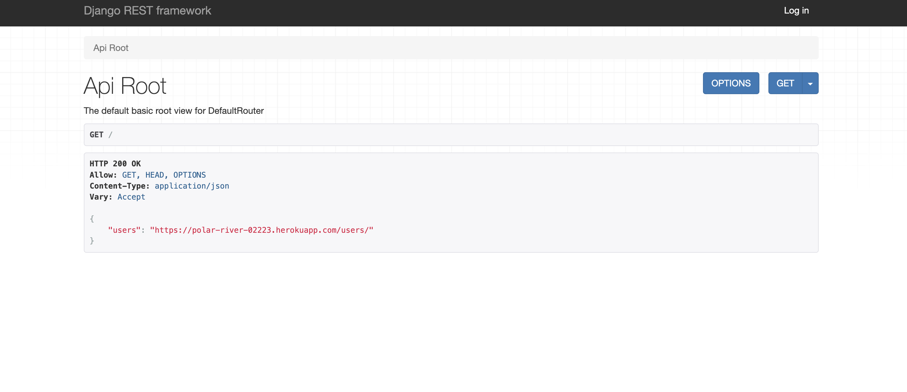

# PeeP API



## Description

This repo is the backend used for the site PeeP: https://peeep.netlify.app/. It is used to store users info, and posts created by users. It utulizes PostgreSQL for its database. It is deployed through heroku and utulizes aws to store images.

## Technologies
- Python
- Django
- PostgreSQL
- AWS

## Setup

fork and clone this repository 
```sh
$ git clone https://github.com/Peep-Coders/PeeP-BackEnd.git
$ cd PeeP-BackEnd
```
create a virtual enviornment to install dependencies in
```sh
$ pipenv shell
```
install dependencies
```sh
$ pipenv install -r requirements.txt
```

## Contributions
- Source code: https://github.com/Peep-Coders/PeeP-BackEnd
- Submit an Issue: https://github.com/Peep-Coders/PeeP-BackEnd/issues